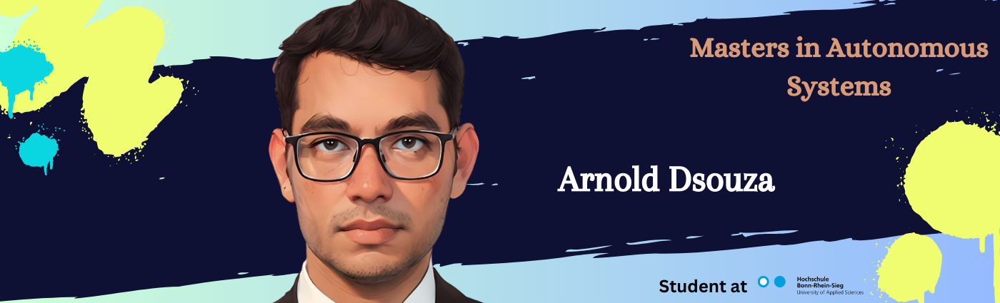

<h2>Hey! Arnold Here 👋</h2>

 

 

<h2>💻 Education</h2>

- Current: Masters in Autonomous Systems, Hochschule Bonn-Rhein-Sieg (H-BRS), Germany 
- Previous: Bachelors of technology in Mechatronics Engineering, Symbiosis Skills and Professional University, India

<h2>👀 Stats</h2>

  

  <b><em>GitHub Stats:</em></b>  
     
  <b><em>Programming activity (Last 7 days):</em></b>  
    <picture>
  <source
    srcset="https://github-readme-stats.vercel.app/api?username=Arnold-Dsouza&show_icons=true&theme=highcontrast"
    media="(prefers-color-scheme: dark)"
  />
  <source
    srcset="https://github-readme-stats.vercel.app/api?username=Arnold-Dsouza&show_icons=true"
    media="(prefers-color-scheme: light), (prefers-color-scheme: no-preference)"
  />
  
</picture>
  

 

<h2>🛠️ Skills & Technologies</h2>

  
### Programming Languages

### Robotics & AI

### Web Development

### Tools & Frameworks

### Engineering & Design

<h2> About me⚡:</h2>

Enthusiastic Autonomous Systems Master's student with a strong foundation in Mechatronics Engineering. Experienced in diverse technical areas, from machine learning and robotics to PLC programming, etc. Committed to collaborative success, seeking opportunities to contribute to dynamic work environments.

<h2>📫 How to reach me:</h2>

   
